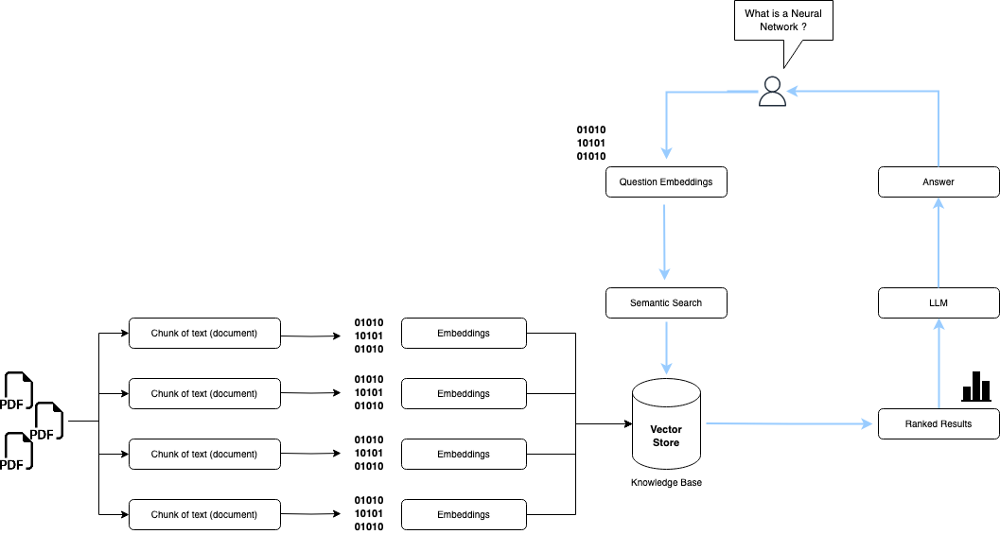

# Demo AI application to chat with multiple PDFs  

## Introduction
------------
The multi-pdf-chat is a Python application that allows you to chat with multiple PDFs documents. 
You can ask questions about the PDFs using natural language, and the application will provide relevant responses 
based on the content of the documents. This app utilizes a language model (LLM) to generate accurate answers 
to your queries. Please note that the app will only respond to questions related to the loaded PDFs.
The application also was built with streamlit (https://streamlit.io/) a really great Python library that turns data 
scripts into shareable web apps in minutes. 

## How It Works
------------



The application follows these steps to provide responses to your questions:

1. PDF Loading: The app reads multiple PDF documents and extracts their text content.

2. Text Chunking: The extracted text is divided into smaller chunks (could be dynamically change) that can be processed effectively.

3. Language Model: The application utilizes a language model to generate vector representations (embeddings) of the text chunks. (using OpenAPI and also another embedding model like instructor-xl from HuggingFace hub)

4. Similarity Matching: When you ask a question, the app compares it with the text chunks and identifies the most semantically similar ones.

5. Response Generation: The selected chunks are passed to the language model, which generates a response based on the relevant content of the PDFs.

## Dependencies and Installation
----------------------------
To install the MultiPDF Chat App, please follow these steps:

1. Clone the repository to your local machine.

2. Install the required dependencies by running the following command:
   ```
   pip install -r requirements.txt
   ```

3. Obtain an API key from OpenAI and add it to the `.env` file in the project directory.
```commandline
OPENAI_API_KEY=<your_openai_key>
# if use huggingface embeddings then:
HUGGINGFACEHUB_API_TOKEN=<your_huggingfacehub_key>
```

## Usage
-----
To use the multi-pdf-chat, follow these steps:

1. Ensure that you have installed the required dependencies and added the OpenAI API key to the `.env` file.

2. Run the `app.py` file using the Streamlit CLI. Execute the following command:
   ```
   streamlit run app.py
   ```

3. The application will launch in your default web browser, displaying the user interface.

4. Load multiple PDF documents into the app by following the provided instructions.

5. Ask questions in natural language about the loaded PDFs using the chat interface.

## Contributing
------------
This repository is intended for educational purposes and does not accept further contributions.
It serves as supporting material for every person that wants to learn how to build this kind of projects. 
Feel free to utilize and enhance the app based on your own requirements.

## License
-------
The multi-pdf-chat is released under the [MIT License](https://opensource.org/licenses/MIT).